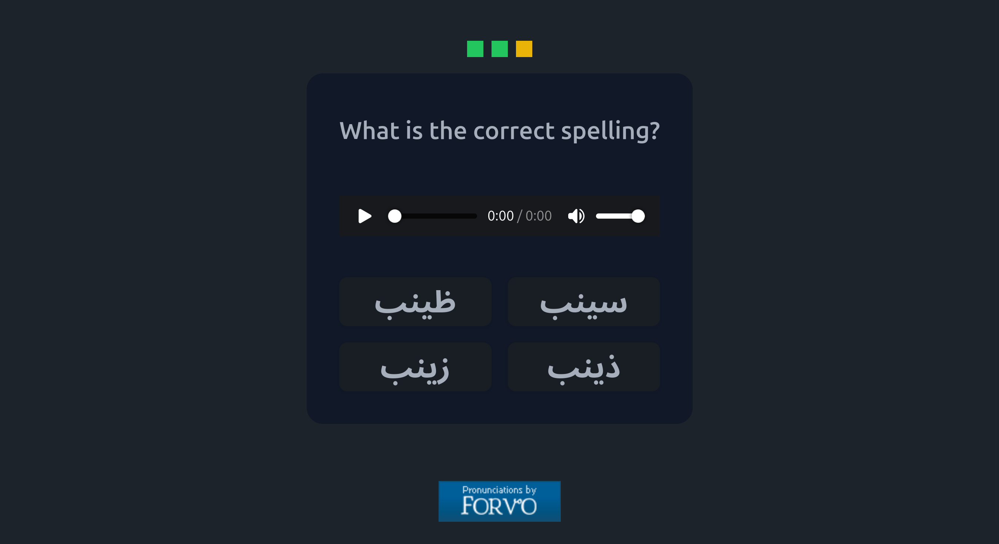

# Arabic Minimal Pairs Trainer



A small Flask web app for training your ear on Egyptian Arabic minimal pairs.

Each round plays a native-speaker recording of a random word or phrase from [Forvo](https://forvo.com). You then pick the correct spelling from up to four options. The wrong options differ from the right one in a single easily confused letter (e.g. ح/ه/ع, س/ص/ث/ز, ت/ط, د/ض, ك/ق).

## Requirements

- Python ≥ 3.13
- [uv](https://docs.astral.sh/uv/)
- A Forvo API key: <https://api.forvo.com>

## Run locally

```bash
uv sync
export FORVO_KEY=your_forvo_api_key
uv run flask --app app run --debug
```

Then open <http://127.0.0.1:5000>.

## Run in production

```bash
FORVO_KEY=your_forvo_api_key uv run gunicorn app:app
```

On [Render](https://render.com), use `pip install uv && uv sync` as the build command and `uv run gunicorn app:app` as the start command, and set `FORVO_KEY` as an environment variable.

## Word list

The word pairs are hardcoded in `app.py` (`items`). Each key is the correct spelling, and its value lists the distractor spellings.
